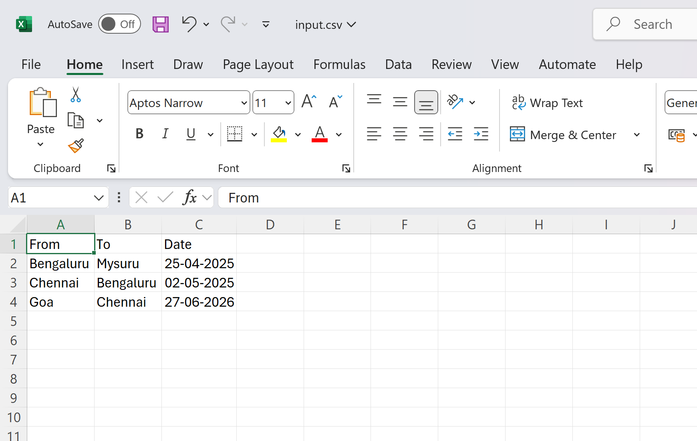
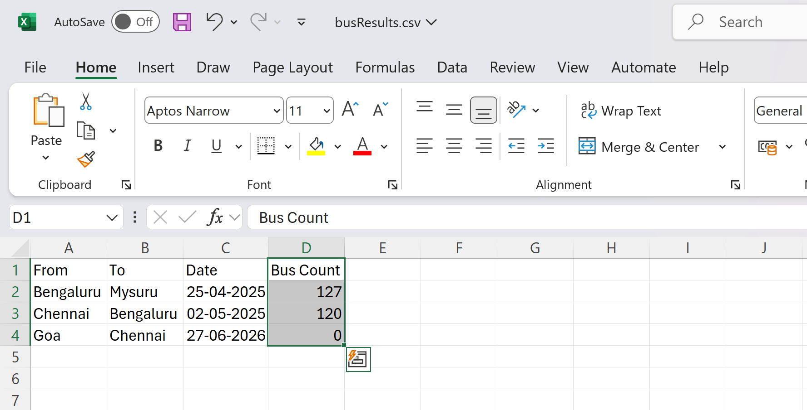

# redbus-ddt-automation
Implements Data Driven Testing using selenium, testng in redbus ticket booking webapplication automation

# RedBus Data-Driven Automation Framework  
**Selenium WebDriver + TestNG | CSV Data-Driven Testing**  


##  Overview  
Automated test framework for [RedBus.in](https://www.redbus.in) implementing **Data-Driven Testing (DDT)** using:  
- **Selenium WebDriver** (Browser automation)  
- **TestNG** (Test management & reporting)  
- **CSV files** (Input test data/output results)  

##  Key Features  
**CSV-Driven Test Cases** - Separate test logic from data  
**Dynamic Test Execution** - Run tests with multiple datasets  
**Automated Reporting** - TestNG HTML reports + CSV outputs  
**Page Object Model** - Maintainable UI locators  

## ⚙️ Setup  
1. **Prerequisites**:  
   - Java JDK 8+  
   - Maven  

2. **Clone & Run**:  
   ```bash
   git clone https://github.com/berylsergious/redbus-ddt-automation.git


## 🎥 Demo
Edit input.csv file to update Date column to future dates



Automation in action


Output.csv file has the buscount fetched from website


